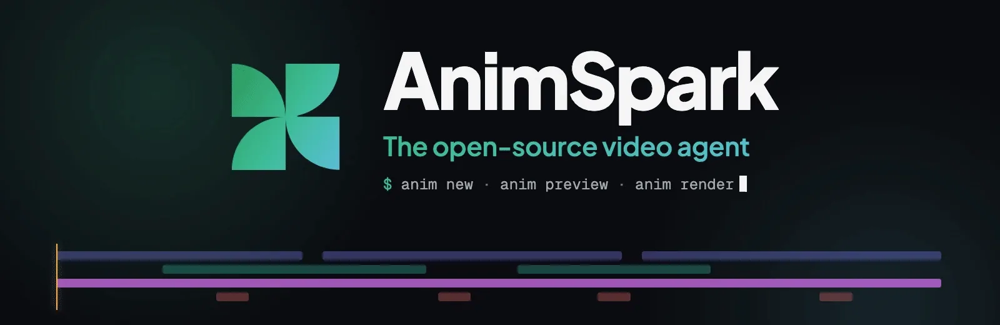

  

<h3 align="center">Films your coding agent can write.</h3>

  AnimSpark makes whole films — story, motion, music, voice and the cut — and every frame is code you can read, diff and change.

  <a href="https://github.com/animspark/animspark"><b>animspark/animspark</b></a> — the open-source engine: film format, frame-exact renderer, music engine, and the skills that let Claude Code, Codex or Cursor make films on your machine. 
  <a href="https://animspark.com"><b>animspark.com</b></a> — the AnimSpark app: a timeline editor, direct manipulation on the canvas, and an AI director that plans and writes the film with you.

  <code>npm install -g animspark</code> · <a href="https://github.com/animspark/animspark#quick-start">Quick start</a> · <a href="https://github.com/animspark/animspark/tree/main/examples">Examples</a> · <a href="https://github.com/animspark/animspark/discussions">Discussions</a>

